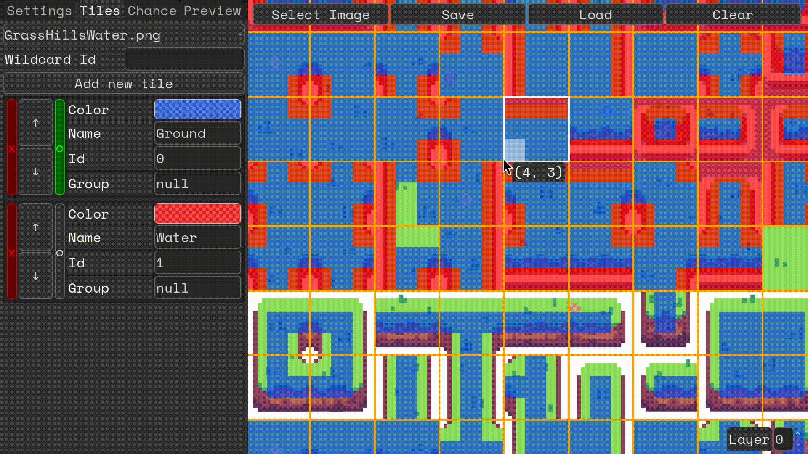

# LibreAutoTile

Implementation of an autotile algorithm for tilemaps with JSON configuration, supporting various tile ID terrain transitions.



## Features

- Isometric tile support
- Tile probability for same bitmask
- Connection groups and wildcard tile IDs
- Fully async-compatible
- Dedicated GUI for configuration
- Game engine-agnostic core library
- [High performance](LibreAutoTile.Benchmarks/README.md)

## Usage

For documentation, see the `README.md` files in the subdirectories:

- [Core library](LibreAutoTile/README.md)
- [Godot bindings](LibreAutoTile.GodotBindings/README.md)
- [Tests](LibreAutoTile.Tests/README.md)
- [Benchmarks](LibreAutoTile.Benchmarks/README.md)
- [GUI](LibreAutoTile.GUI/README.md)
- [Godot example project](LibreAutoTile.GodotExample/README.md)

A dedicated [GUI](LibreAutoTile.GUI) is available. Compiled binaries are in [Releases](https://github.com/ruedoux/libre-auto-tile/releases).

Sample JSON configurations are in [`resources/configurations/`](resources/configurations).

## Installation

1. Link the `.csproj` from this repository (for the latest version), or
2. Install from NuGet:

If you want to install the Godot bindings:

```sh
dotnet add package Qwaitumin.LibreAutoTile.GodotBindings
```

If you want to install the core library:

```sh
dotnet add package Qwaitumin.LibreAutoTile
```

> Library targets:

```xml
<TargetFramework>net9.0</TargetFramework>
<LangVersion>12.0</LangVersion>
```

## Compilation

Use the `build.sh` script (on Windows use WSL or compile each project manually):

- `./build.sh --build-libs` — pack the core and Godot bindings libraries
- `./build.sh --build-gui` — export the GUI for Linux and Windows
- `./build.sh --build-all` — build libraries and GUI
- `./build.sh --run-tests` — run the core and Godot bindings tests
- `./build.sh --run-benchmark` — run the benchmarks
- `./build.sh --publish <version>` — pack, test, and publish a release (maintainers only)

## Game Engine Integration

Currently, only Godot engine bindings are supported. Contributions for other game engine bindings are welcome.

Example usage in a live project [here](LibreAutoTile.GodotExample/Scenes/Examples).

Library bindings draw terrains [50x](LibreAutoTile.GodotExample/Scenes/Comparasion) faster than the Godot terrain implementation (relative, might vary).

## Contributions

Anyone is free to contribute. Before creating a large component, please open an issue to ensure it aligns with the project's direction.

## Additional Mentions

- Check out [better-terrain](https://github.com/Portponky/better-terrain) which partially inspired this project.
